### 1\. 프로젝트 소개

#### 1.1. 개발배경 및 필요성

부산대학교 학생들은 점심·저녁 시간대 학생식당을 이용할 때 실제 대기 인원과 예상 대기 시간을 알기 어렵고, 현장 식권 구매 줄과 배식 대기 줄이 혼동되어 불필요한 혼잡과 시간 낭비가 발생하고 있습니다. 특히 금정회관은 1층 정식·1층 단품·2층 정식의 3개 라인이 별도로 운영되지만, 어느 라인이 빠른지 도착 전까지 알 방법이 없습니다. 또한 부산대 앞 상권은 공실률이 23.4%에 달하는 등 학생 수요를 지역 식당으로 연결할 통합 플랫폼이 부재한 상황입니다. '캐치테이블', '테이블링' 등 기존 웨이팅 플랫폼은 일반 외식업장 중심으로 운영되어 대학 캠퍼스 특화 기능을 제공하지 않아, 일반 외식 시장의 예약 문화와 대학 생활 사이의 디지털 격차 해소가 필요합니다. 

#### 1.2. 개발목표 및 주요내용

부산대학교 학생식당의 이용 불편을 해소하고, 부산대 인근 지역상권과 학생을 연결하는 캠퍼스 맞춤형 통합 웨이팅 플랫폼 **"PNU 밥묵자"** 를 개발하는 것입니다. 학생들이 학식과 주변 식당을 비교하여 효율적으로 식사 장소를 선택할 수 있도록 하고, 지역 식당은 부산대 학생 고객을 안정적으로 유입할 수 있는 지역 상생형 플랫폼 구축을 목표로 합니다. 

#### 1.3. 세부내용

- **통합 웨이팅 플랫폼:** 학식 라인별(1층 정식·1층 단품·2층 정식) 및 주변 식당의 실시간 대기 현황 정보 제공  
- **디지털 체크인:** 모바일 QR 식권 및 대기번호 발급을 통한 현장 혼잡도 최소화 (식권 줄과 배식 줄 분리)  
- **상권 활성화 기능:** 단과대별 제휴 혜택 노출 및 인근 식당 원격 웨이팅·쿠폰 시스템 구축  
- **AI 기능:** GPT-4o-mini 기반 메뉴 자연어 검색 챗봇 및 시계열 모델 기반 시간대별 혼잡도 예측

#### 1.4. 기존 서비스(상품) 대비 차별성 및 사용자 락인(Lock-in) 전략

기존 학생식당 이용 방식은 학생이 직접 식당에 방문한 뒤 현장 키오스크에서 식권을 구매하고, 배식 줄에 서서 기다리는 구조로 대기 정보를 사전에 알 수 없습니다. 테이블링·캐치테이블 같은 기존 웨이팅 플랫폼은 **수수료 기반 외식업장 모델**이라 단가가 낮고 학교 인증이 필요한 학식·캠퍼스 시장에 구조적으로 진입하기 어렵습니다. **PNU 밥묵자**는 이 구조적 공백을 정조준한 캠퍼스 맞춤형 서비스입니다.

**▪ 기존 플랫폼과의 차별점**

| 구분 | 캐치테이블 · 테이블링 | PNU 밥묵자 |
| :---: | :---: | :---: |
| 핵심 대상 | 객단가 높은 외식업장 | 학식 \+ 캠퍼스 인근 캐주얼 식당 |
| 학식 라인별 대기 | ✕ (식당 단위만) | ○ (라인 단위) |
| 모바일 식권 · 배식 분리 | ✕ | ○ |
| 학번 인증 · 단과대 혜택 | ✕ | ○ |
| 학사 컨텍스트 연계 | ✕ | ○ (강의 동선 · 학사일정) |

**▪ 사용자 락인(Lock-in) 3종 전략**

단순 웨이팅 앱은 대체가 쉽기 때문에, 전환 비용을 만드는 세 가지 장치로 사용자를 묶습니다.

- **모바일 식권 (전환 비용):** 앱에서 식권을 충전·구매하면 잔액과 이력이 쌓여 이탈이 어려워집니다.  
- **단과대 쿠폰 · 학생 할인 (혜택 독점):** 학번 인증자만 받는 혜택으로, 타 플랫폼이 제공할 수 없는 독점 가치입니다.  
- **식사 이력 · 개인화 추천 (데이터 축적):** 사용할수록 취향·식이 선호를 학습해 추천이 정교해집니다.

이 세 장치는 모두 **"학교 인증 \+ 학식"이라는 진입 장벽** 위에 세워져 있어 기존 플랫폼이 모방하기 어렵습니다. 

#### 1.5. 사회적가치 도입 계획

- **지역 상권 상생(ESG):** 높은 수수료의 대형 플랫폼 대신 대학생-소상공인을 직접 연결하는 저비용 시스템을 제공하여 지역 경제 생태계 회복에 기여  
- **환경적 가치:** 학식 수요 예측을 통해 무분별한 식재료 낭비를 줄이고 잔반 발생량을 감소  
- **전공 역량 환원:** 전자공학과 및 반도체 전공 지식을 활용하여 저전력 IoT 단말기를 식당에 보급하는 기술을 통한 지역 문제 해결 모델 제시  
- **정량적 목표:** 런칭 후 1년 내 재학생 60% 이상 가입, 제휴 매장 100곳 이상 확보, 학식 현장 대기 시간 평균 30% 단축

#### 1.6. 실시간 대기 데이터 수집 방안 및 운영주체 협력

본 서비스의 핵심 기술 과제는 "별도 센서 없이 어떻게 실시간 대기 인원을 아는가"입니다. 이를 **모바일 식권 발급 데이터**로 해결합니다. 앱에서 식권을 구매하면 그 자체가 대기열 등록이 되므로, 별도 장비나 운영자 입력 없이도 앱 사용자 기준 대기 인원을 정확히 집계할 수 있습니다. 이 구조는 운영자 협조가 전혀 없어도 작동하는 **1차 데이터 소스**이자 서비스 도입 초기의 안전판입니다.

**▪ 3단계 데이터 수집 모델**

| 단계 | 데이터 소스 | 정확도 | 운영자 협조 | 적용 시점 |
| :---: | :---- | :---: | :---: | :---: |
| 1차 (MVP) | 모바일 식권 · 대기번호 발급 데이터 | 앱 사용자 기준 정확 | **불필요** | 해커톤 기간 |
| 2차 | 운영자 호출 버튼 (배식 1명 \= 대기 \-1) | 매우 높음 | 필요 | 생협 협의 후 |
| 3차 | Vision AI 입구 줄 카운팅 (보조 검증) | 중간 | 카메라 설치 | 확장 단계 |

**▪ 운영주체(생협) 협력 방식**

부산대 학식은 생활협동조합(생협)이 운영합니다. 협력은 ① 무상 운영자 대시보드 제공으로 진입 장벽을 없애고, ② 식권 데이터 연동으로 생협에 디지털 전환·혼잡 완화 이득을 제공하며, ③ SW중심대학 사업·창업트랙과 연계해 "학생 복지 개선" 프로젝트로 접근하는 단계적 방식으로 추진합니다.

**▪ 콜드 스타트 대응**

서비스 초기 사용자가 적어 데이터가 부족한 문제는, 모바일 식권 소액 할인·적립 인센티브, 단과대 학생회와의 학과 단위 동시 가입 이벤트, 데이터가 충분해질 때까지 "현재 앱 기준 대기 OO명" 정직 표기로 대응합니다. 

### 2\. 상세설계

#### 2.1. 시스템 구성도
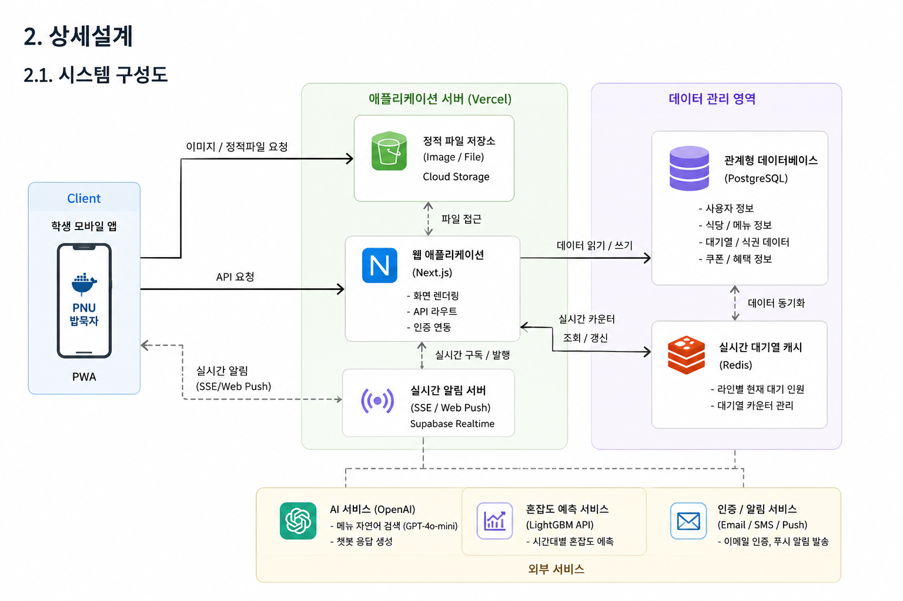

#### 2.2. 사용기술

| 이름 | 버전 / 비고 |
| :---: | :---: |
| TypeScript | \- |
| Next.js (App Router) | 14 |
| Tailwind CSS | \- |
| shadcn/ui | \- |
| Zustand | 전역 상태 관리 |
| TanStack Query | 서버 상태 / 캐싱 |
| Supabase Realtime / SSE | 실시간 통신 (Vercel 서버리스 호환) |
| NextAuth.js | 학교 이메일 기반 OAuth / 매직 링크 |
| Node.js | 20 |
| PostgreSQL (Supabase) | 식당 / 대기열 / 사용자 데이터 |
| Redis (Upstash) | 실시간 대기열 카운터 |
| Vercel | FE \+ API 인프라 |
| OpenAI GPT-4o-mini | 메뉴 자연어 검색 / 챗봇 |
| LightGBM | 시계열 기반 혼잡도 예측 모델 |
| Cursor | 메인 IDE (AI 코딩 도구) |
| GitHub Copilot | 코드 자동완성 |
| Claude Code | 디버깅 / 리팩토링 |
| Claude / ChatGPT | 기획 · UX 카피 · QA 시나리오 작성 |
| Midjourney / DALL-E | 앱 아이콘 · 식당 일러스트 · 마케팅 이미지 |

※ 서비스 형태는 "앱"이나, 앱스토어 네이티브 앱이 아닌 **PWA 방식**으로 iOS·Android를 단일 코드베이스로 동시 지원하며 홈 화면 추가·푸시 알림·오프라인 캐시를 제공합니다. 실시간 통신은 Vercel 서버리스 환경과 호환되는 Supabase Realtime / SSE를 사용합니다.

### 3\. 개발결과

#### 3.1. 전체시스템 흐름도

- 유저 플로우 차트  
  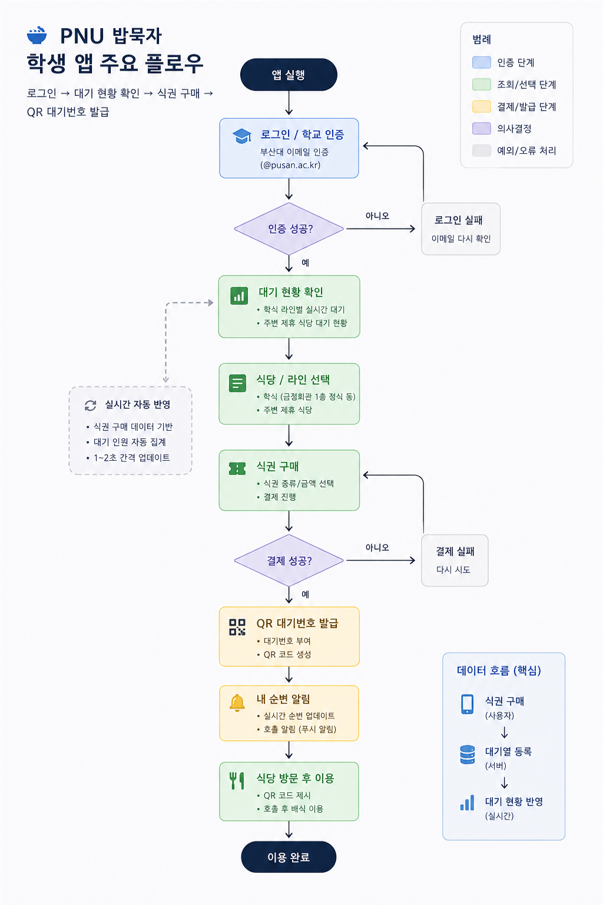
  (학생 앱 주요 플로우 — 로그인 → 대기 현황 확인 → 식권 구매 → QR 대기번호 발급 과정을 도식화하여 삽입하세요.)  
    
- 테스크 플로우 차트  
  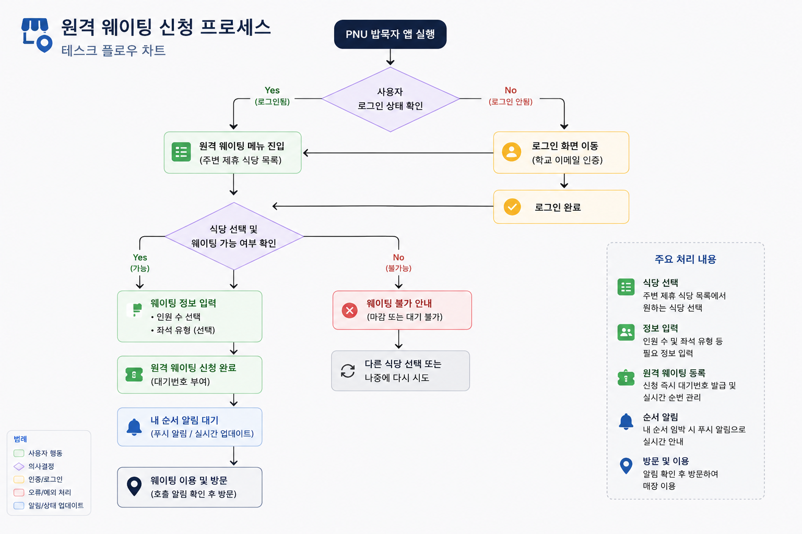
  (원격 웨이팅 신청 프로세스를 도식화하여 삽입하세요.)  
    
- 시스템 플로우 차트  
  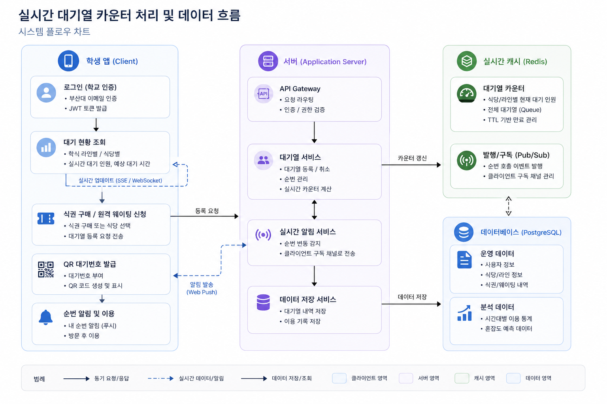
  (실시간 대기열 카운터 처리 및 데이터 흐름을 도식화하여 삽입하세요.)  
    
- IA (Information Architecture)  
  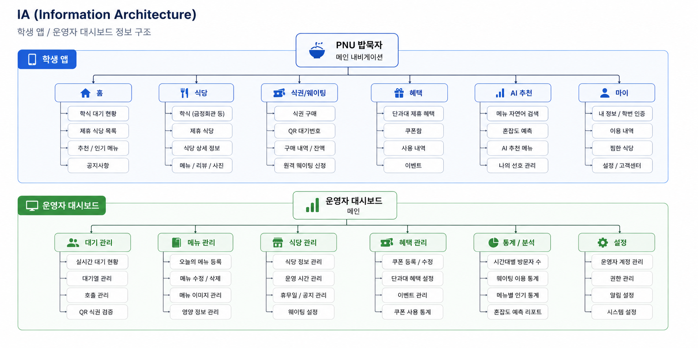
  (학생 앱 / 운영자 대시보드의 정보 구조를 도식화하여 삽입하세요.)

#### 3.2. 기능설명

##### `메인 페이지`

- 학식 실시간 대기 현황  
  - 금정회관 라인별(1층 정식·1층 단품·2층 정식) 현재 대기자 수와 예상 대기 시간을 실시간으로 표시합니다.  
  - 혼잡도를 색상(여유 / 보통 / 혼잡)으로 직관적으로 표현합니다.

  (시연 이미지를 삽입하세요.)
  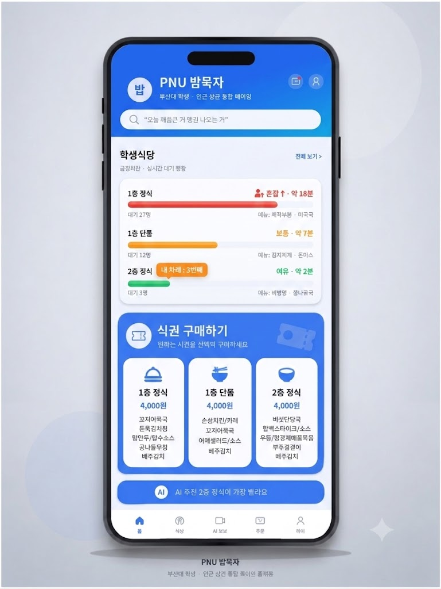

- 주변 제휴 식당 목록  
    
  - 부산대 인근 제휴 식당의 대기 현황, 메뉴, 가격대, 할인 정보를 함께 표시합니다.  
  - 단과대별 제휴 혜택이 있는 식당은 별도 배지로 강조합니다.

  (시연 이미지를 삽입하세요.)
  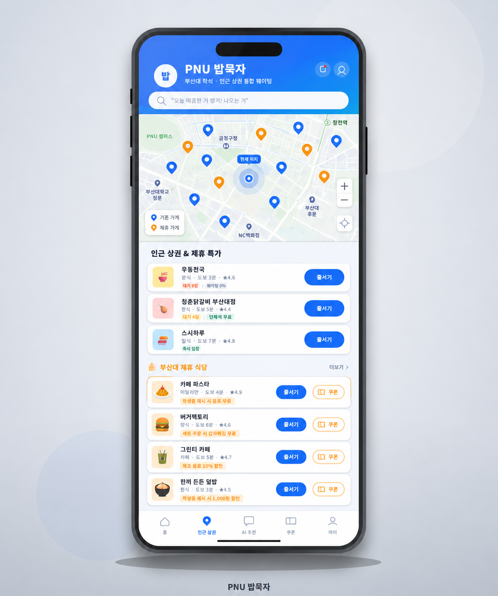

##### `모바일 식권 / 대기번호 페이지`

- 식권 구매  
    
  - 학교 이메일 인증 후 앱에서 바로 식권을 구매할 수 있습니다.  
  - 구매 즉시 QR 코드가 발급되어 현장 키오스크 줄 없이 바로 배식 대기열에 합류합니다.  
  - **식권 구매 데이터가 곧 실시간 대기열 데이터로 집계되어, 별도 장비 없이 라인별 대기 인원을 산출합니다.**

  (시연 이미지를 삽입하세요.)
  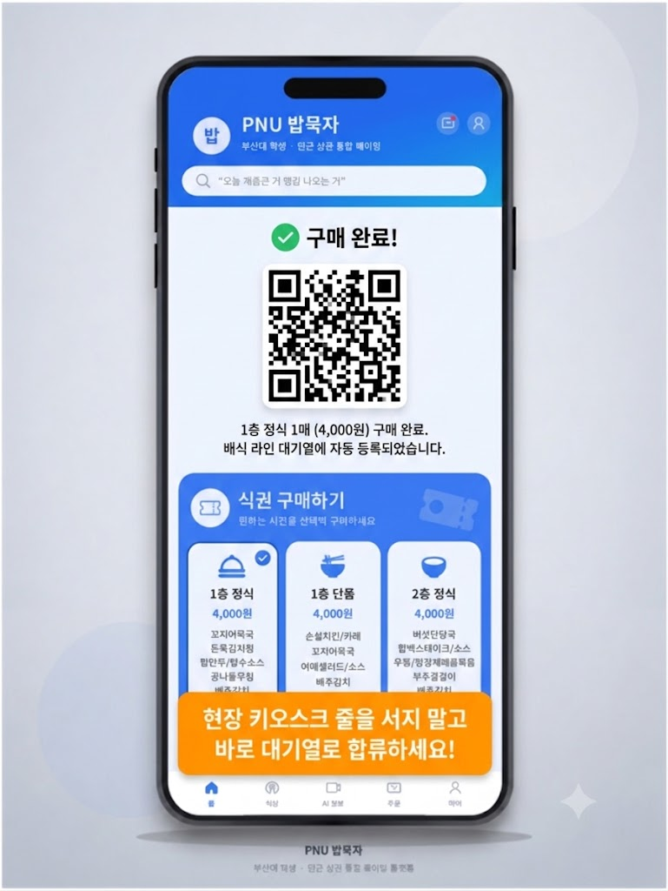

- 원격 웨이팅  
    
  - 제휴 식당을 선택하여 앱에서 바로 웨이팅을 등록합니다.  
  - 내 차례가 가까워지면 푸시 알림(Web Push)을 통해 알려줍니다.

  (시연 이미지를 삽입하세요.)
  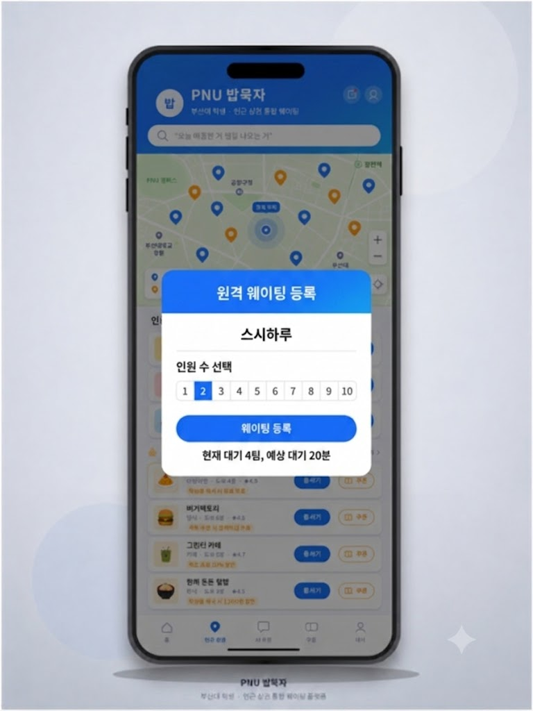

##### `운영자 대시보드`

- 실시간 대기자 관리  
    
  - 현재 대기자 수 확인 및 호출 번호를 순서대로 관리합니다.  
  - QR 코드 스캔으로 모바일 식권 구매 여부를 즉시 검증합니다.

  (시연 이미지를 삽입하세요.)
  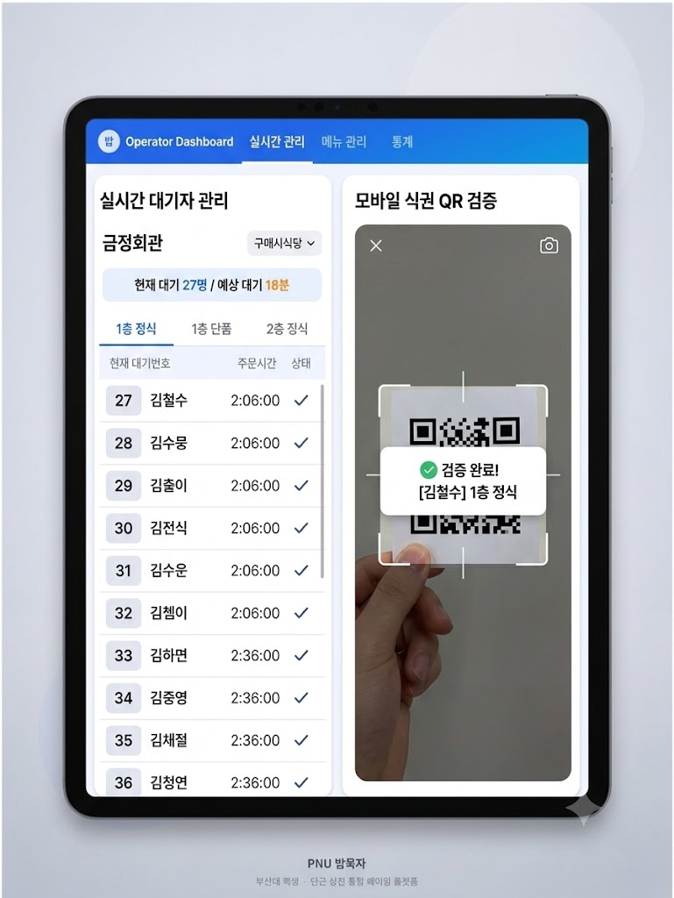

- 메뉴 및 운영 정보 관리  
    
  - 오늘의 메뉴, 운영 시간, 대기 가능 여부를 등록·수정합니다.  
  - 시간대별 이용 현황 및 방문자 통계를 그래프로 확인합니다.

  (시연 이미지를 삽입하세요.)
  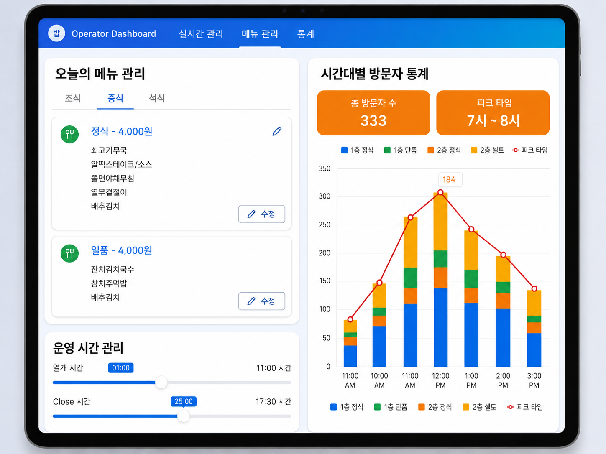

#### 3.3. 기능명세서

(노션 링크, PDF 파일, 구글 스프레드시트 등 기능명세서 링크를 삽입하세요.)

| 라벨 | 이름 | 상세 |
| :---: | :---: | :---- |
| M1 | 학교 이메일 인증 | \- 부산대 웹메일 형식(@pusan.ac.kr) 검증  \- 중복 이메일 검증 |
| M2 | 대기 현황 조회 | \- 학식 라인별 / 제휴 식당 실시간 대기자 수 · 예상 대기 시간 표시 |
| M3 | 모바일 식권 구매 | \- 결제 후 즉시 QR 코드 발급  \- 유효 시간 내 1회 사용 \- 구매 데이터 기반 대기열 자동 집계 |
| M4 | 원격 웨이팅 등록 | \- 제휴 식당 선택 후 대기 등록  \- 순번 알림 (Web Push) |
| M5 | 쿠폰 / 할인 혜택 조회 | \- 단과대별 제휴 혜택 노출  \- 학번 인증 기반 쿠폰 발급 |
| M6 | 메뉴 자연어 검색 | \- GPT-4o-mini API \+ RAG를 통한 자연어 질의 응답 |
| M7 | 혼잡도 예측 | \- LightGBM 시계열 모델 기반 시간대별 혼잡도 예측 및 시각화 |
| A1 | 운영자 대기열 관리 | \- 호출 번호 순서 관리  \- QR 식권 검증 |
| A2 | 메뉴 · 운영 정보 관리 | \- 오늘의 메뉴 등록 · 수정  \- 운영 시간 · 대기 가능 여부 설정 |
| A3 | 이용 현황 통계 | \- 시간대별 방문자 수 및 웨이팅 이용 현황 그래프 |

#### 3.4. 디렉토리 구조

├── app/                        \# Next.js App Router

│   ├── (auth)/                 \# 인증 관련 라우트

│   ├── (student)/              \# 학생용 화면

│   │   ├── main/               \# 메인 페이지 (대기 현황)

│   │   ├── ticket/             \# 모바일 식권 구매

│   │   └── waiting/            \# 원격 웨이팅

│   ├── (admin)/                \# 운영자 대시보드

│   └── api/                    \# API Routes

├── components/                 \# 공통 UI 컴포넌트

├── lib/                        \# 유틸리티 및 외부 연동

│   ├── supabase/               \# Supabase 클라이언트

│   ├── redis/                  \# Upstash Redis 연동

│   └── ai/                     \# OpenAI API 연동

├── store/                      \# Zustand 전역 상태

├── types/                      \# TypeScript 타입 정의

├── docs/                       \# 보고서 및 발표자료

└── public/                     \# 정적 파일

#### 3.5. AI 도구 활용

AI 활용은 **(A) 개발 과정에서의 AI 코딩·생성 도구**와 **(B) 서비스에 탑재되는 AI 기능**으로 구분됩니다.

**(A) 개발 과정 — AI 코딩 · 생성 도구**

- **신속한 프로토타이핑:** ChatGPT를 활용하여 주요 화면 UI 컴포넌트 구조와 Supabase RLS 보안 규칙 초안을 생성하여 개발 시간을 단축함.  
- **코드 자동완성:** GitHub Copilot을 사용하여 반복적인 데이터 처리 로직 및 API 연동 코드를 신속하게 작성함.  
- **로직 검증 및 디버깅:** 실시간 대기열 처리 중 발생할 수 있는 Race Condition 문제를 Claude를 통해 사전 분석하고 해결 방안을 도출하여 시스템 안정성을 높임.  
- **UI/UX 개선:** Figma AI를 활용하여 대기 현황 시각화 레이아웃과 관리자 대시보드 시안을 제작함.

**(B) 서비스 탑재 AI 기능 — 용도별 모델 분리**

- **메뉴 자연어 검색 · 챗봇:** OpenAI GPT-4o-mini API \+ RAG로 오늘의 메뉴·대기 정보를 컨텍스트로 주입하여 자연어 질의에 응답함.  
- **혼잡도 예측:** 시간·요일·학사일정 변수를 입력으로 받는 LightGBM 시계열 회귀 모델로 시간대별 혼잡도를 예측함. (자연어 모델이 아닌 시계열 모델을 사용하여 문제 유형에 맞는 정량 예측 수행)

### 4\. 설치 및 사용 방법

**필요 패키지**

- 위의 사용 기술 참고 (Node.js v20 이상, PostgreSQL, Redis)

$ git clone https://github.com/pnuai/pnuai-c-06.git

$ cd pnuai-c-06

$ npm install

\# 환경변수 설정 (.env.local)

$ cp .env.example .env.local

\# NEXT\_PUBLIC\_SUPABASE\_URL, SUPABASE\_SERVICE\_ROLE\_KEY,

\# UPSTASH\_REDIS\_REST\_URL, OPENAI\_API\_KEY 등 입력

$ npm run dev        \# 개발 서버 실행 (http://localhost:3000)

$ npm run build      \# 프로덕션 빌드

$ npm start          \# 프로덕션 실행

### 5\. 비즈니스 모델 및 확장 전략

#### 5.1. 수익 모델

학식은 **무료 공공 서비스**로 운영하여 사용자를 모으고, 수익은 **외부 제휴 식당**에서 발생시키는 양면 시장(two-sided market) 구조입니다.

| \# | 수익원 | 내용 | 발생 시점 |
| :---: | :---- | :---- | :---: |
| 1 | 입점 수수료 | 제휴 식당 월 구독 (캐치테이블의 약 1/3 수준 저가) | 6개월\~ |
| 2 | 웨이팅 건당 수수료 | 원격 웨이팅 성사 건당 소액 과금 | 1년\~ |
| 3 | 상권 타겟 광고 | 단과대 · 학년 타겟 노출, 프리미엄 배너 | 1년\~ |
| 4 | (초기) 지자체 사업 연계 | 금정구 상권 활성화 60억 사업 보조금 | 초기 |

핵심은 **저(低)수수료 구조**입니다. 대형 플랫폼의 높은 수수료에 부담을 느끼는 캠퍼스 인근 소상공인에게 1/3 수준의 입점비로 진입하여, 사각지대 시장을 빠르게 확보합니다. 학식 무료 정책으로 모은 대규모 학생 사용자가 제휴 식당의 가치를 끌어올립니다. 

#### 5.2. 단계별 확장 전략

| Phase | 시기 | 범위 | 핵심 목표 |
| :---: | :---: | :---- | :---- |
| Phase 1 | \~\`26.08 (해커톤) | 금정회관 \+ 부산대 앞 파일럿 식당 2\~3곳 | MVP 실배포, 식권 데이터 기반 대기열 검증 |
| Phase 2 | \~\`26.12 | 학내 전체 식당 \+ 부산대 앞 제휴 20곳+ | 운영자 호출 연동, 수익 모델 검증 시작 |
| Phase 3 | \~\`27 상반기 | 부산대 인근 캐치테이블 미도입 100곳+ | 입점 수수료 본격화, 상권 데이터 축적 |
| Phase 4 | \`27 하반기\~ | 타 대학(부경대 · 동아대 등) 라이선싱 | 검증 모델의 타 대학 이식 (PAI+X) |

확장의 기술적 기반은 **처음부터 다중 식당·다중 라인 구조로 설계된 데이터 모델**입니다. 새 식당·새 대학이 추가되어도 코드 변경 없이 데이터만 등록하면 되므로, 타 대학은 각자의 학식 운영주체(생협)와 인근 상권을 그대로 본 모델에 대입할 수 있습니다. 

### 6\. 소개 및 시연영상

(프로젝트 소개 동영상을 [swedu@pusan.ac.kr](mailto:swedu@pusan.ac.kr) 로 제출 후 센터에서 부여받은 YouTube URL을 아래에 삽입하세요.)

### 7\. 팀 소개

| 권지효 | 한지양 | 유동훈 | 조우진 | 박강현 |
| ----- | ----- | :---: | :---: | ----- |
|  |  |  |  |  |
| [cofls0103@pusan.ac.kr](mailto:cofls0103@pusan.ac.kr) | [sheis21030@pusan.ac.kr](mailto:sheis21030@pusan.ac.kr) | [ehdgns1083@pusan.ac.kr](mailto:ehdgns1083@pusan.ac.kr) | [bswoojin@gmail.com](mailto:bswoojin@gmail.com) | [ks922324@pusan.ac.kr](mailto:ks922324@pusan.ac.kr) |
| PM · 총괄  AI data 테스트 | 기획  AI data 분석 | 프론트엔드 | 백엔드 | DB  디버깅 |

### 8\. 해커톤 참여 후기

- 권지효  
    
  작성하세요.  
    
- 한지양  
    
  작성하세요.  
    
- 유동훈  
    
  작성하세요.  
    
- 조우진  
    
  작성하세요.  
    
- 박강현  
    
  작성하세요.

