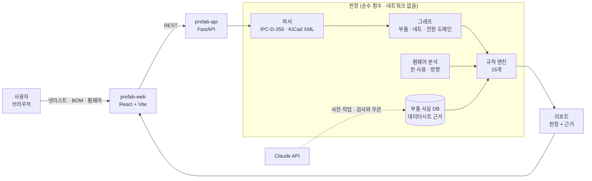
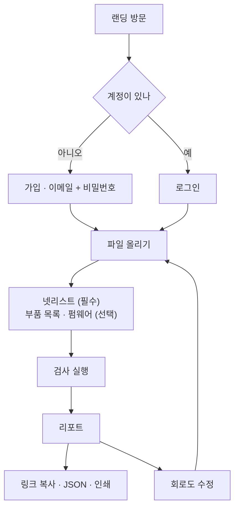
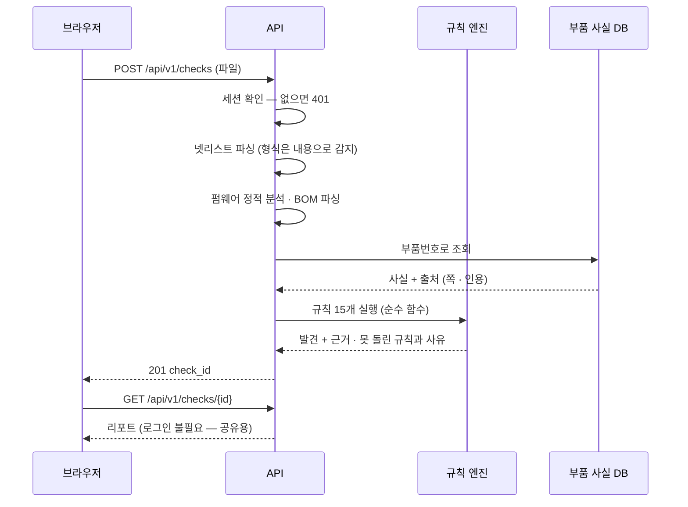
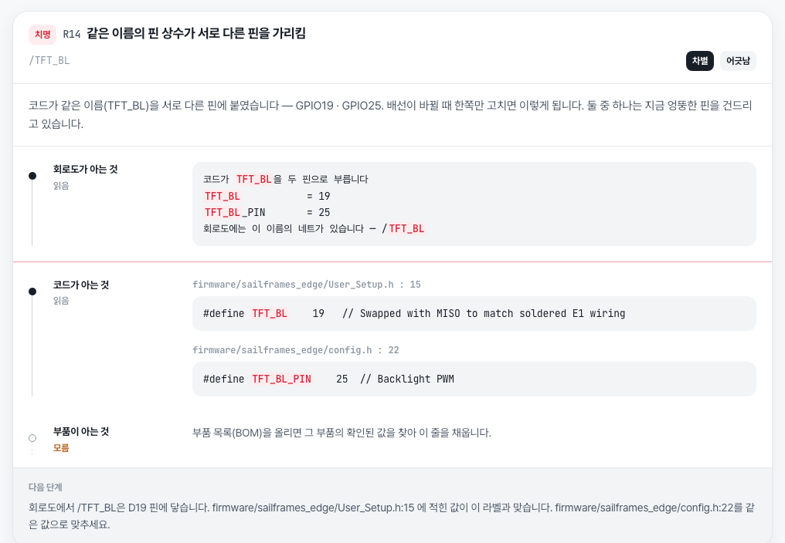
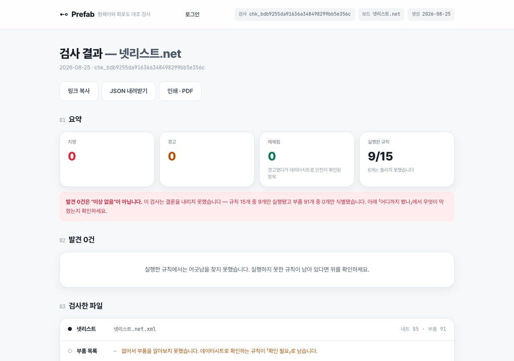
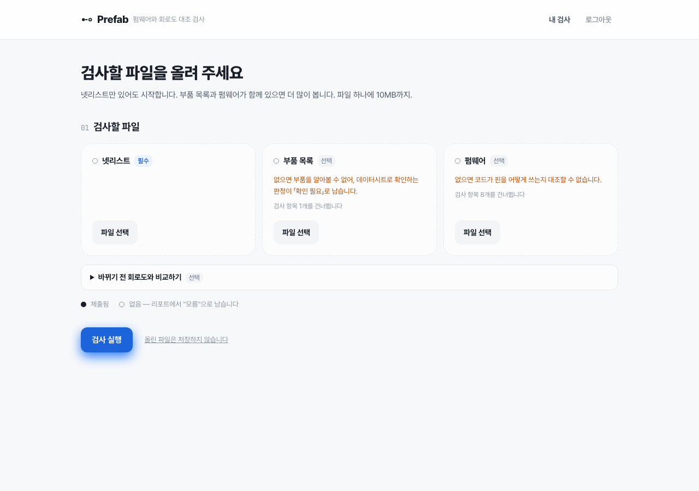
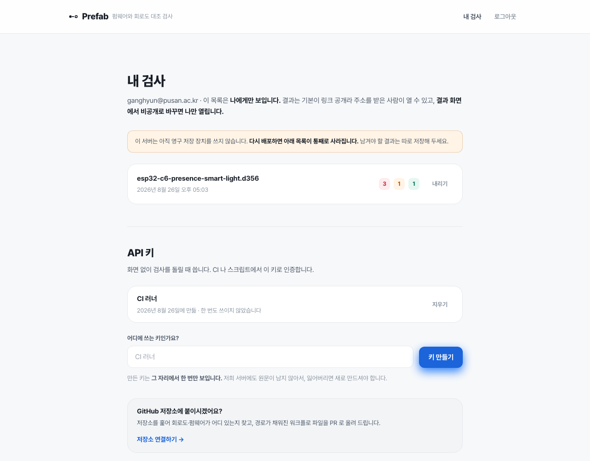
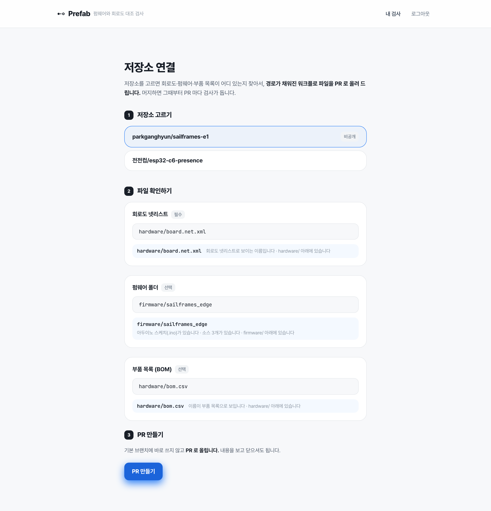
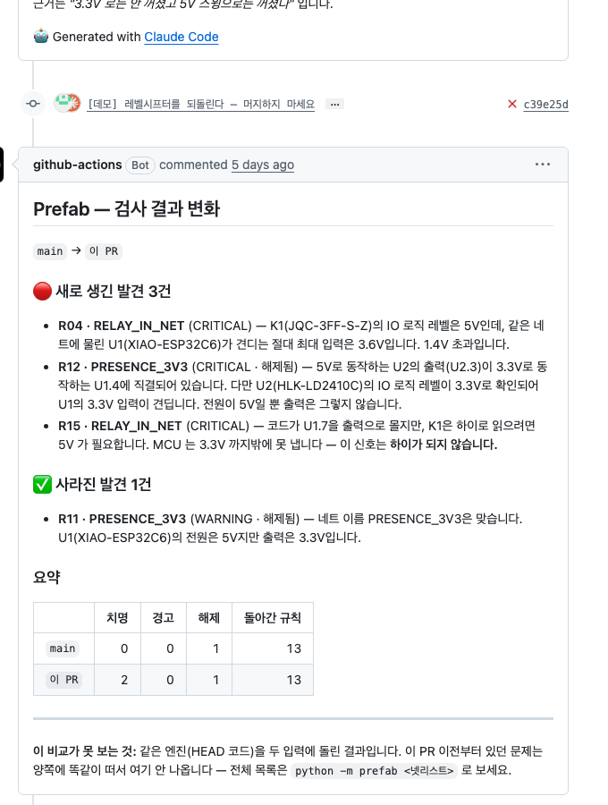

# Prefab


<!-- 이 그림의 원본은 docs/images/_hero-source.html 이다. 문구를 고치면 그 파일 맨 위 명령으로 다시 뽑는다. -->

**보드를 발주하기 전에, 회로도와 코드가 어긋난 곳을 찾습니다.**

넷리스트 · 펌웨어 소스 · 부품 데이터시트를 함께 읽고 셋 사이의 모순을 검출하는 정적 분석 도구입니다.

| | |
|---|---|
| **써 보기** | **https://prefab-web.onrender.com** |
| **직접 돌려보기** | 계정 `review@prefab.demo` / `prefab-review-2026` · 파일은 [`심사위원용/`](./심사위원용) ([안내](./심사위원용/읽어보기.md)) |
| API | https://pnuai-c-06-eece-prefab.onrender.com ([문서](https://pnuai-c-06-eece-prefab.onrender.com/docs)) |
| 시연 영상 | **[유튜브](https://www.youtube.com/watch?v=xuhnsA9rssU)** |
| 규칙 | **15개 전부 구현** (차별 8 · 기본 7) |
| 지원 칩 | **6종** — ESP32 · C3 · C6 · H2 · S3 · RP2040 |
| 테스트 | **892개** 통과 |
| 검증 | 검출 **17/17** · 주입 오탐 **0%** · 홀드아웃 **38개 보드** |
| 실전 | 남의 오픈소스 보드에서 결함을 찾아 **[제보했습니다](https://github.com/FForzano/xgsail-e1/issues/5)** |

---

## 1. 프로젝트 소개

### 1.1. 개발배경 및 필요성

> ## *"LED가 ON은 되는데 OFF가 안 되는 게 문제야."*
>
> — 2026년 8월 21일, 부산대 전기전자컴퓨터공학과. 저희 팀 하드웨어 담당의 메시지입니다.

기판은 이미 발주해서 도착한 뒤였습니다. 회로도 검사도 통과했고, 코드도 컴파일되고
업로드까지 됐습니다. **그런데 3.3V 로 도는 마이크로컨트롤러가 5V 릴레이를 끄지
못하고 있었습니다.**

문제는 **회로도에도, 코드에도 없었습니다. 둘 사이에 있었습니다.**
회로도만 보는 검사는 선이 이어져 있으니 정상이라 했고, 코드만 보는 컴파일러는
숫자가 맞으니 통과시켰습니다. 아무도 두 개를 **나란히 놓고 보지 않았습니다.**

그 결함이 지금 이 도구의 규칙 **R15** 가 됐습니다.

---

#### 이건 저희만의 실수가 아닙니다

<pre><i><b>#define TFT_BL     19   // Swapped with MISO to match soldered E1 wiring
#define TFT_BL_PIN 25   // Backlight PWM</b></i></pre>
<p align='right'><a href='https://github.com/FForzano/xgsail-e1'>— GitHub 공개 저장소 <code>FForzano/xgsail-e1</code> (Apache-2.0) 中</a></p>

같은 이름을 두 파일이 서로 다른 핀으로 부르고 있습니다. 개발자가 배선을 바꾸면서
위쪽은 고쳤고 **주석까지 남겼는데 아래쪽이 안 따라왔습니다.** 회로도상 25번은 화면과
통신하는 SPI 데이터선이라, 이 코드는 지금 **통신선에 밝기 조절 신호를 걸고 있습니다.**

저희가 만든 예제가 아닙니다. **오늘도 그대로 공개돼 있는 실제 프로젝트입니다.**
그리고 이건 실력의 문제가 아닙니다 — 주석까지 남길 만큼 신경 쓰고 있었고,
**파일이 여러 개였을 뿐입니다.**

저희 도구가 이걸 찾았고, **그 저장소에 직접 제보했습니다** —
[FForzano/xgsail-e1#5](https://github.com/FForzano/xgsail-e1/issues/5).

---

**컴파일도 되고 업로드도 되는데 보드가 안 도는 버그가 있습니다.**

```c
// config.h
#define LED_PIN 34

// main.cpp
pinMode(LED_PIN, OUTPUT);   // 컴파일 통과. 업로드 성공. LED는 안 켜짐.
```

구형 ESP32 의 `GPIO34` 는 **입력 전용**입니다. 실리콘에 출력 회로가 없습니다.
컴파일러는 `34` 를 그냥 숫자로 봅니다. 회로도 DRC 는 선이 이어져 있으니 정상이라고 합니다.

문제가 **코드와 회로도 사이**에 있어서 어느 쪽 검사에도 안 걸립니다.
보드가 도착해서 안 켜질 때 알게 되고, 그때는 PCB 를 이미 발주한 뒤입니다.

맨 위의 저희 릴레이 사고가 정확히 이 모양이었습니다.

---

#### 그런데 이건 개인의 실수 문제가 아닙니다

소프트웨어는 틀리면 다시 배포하면 됩니다. **하드웨어는 기판을 이미 뽑았으면
돈과 시간이 사라집니다.**

| 재작업 횟수 | 1회당 비용 | 1회당 지연 |
|:---:|:---:|:---:|
| **평균 2.9회** | **$44,000** (약 6천만원) | **8.5일** |

<p align='right'><sub>— Lifecycle Insights 조사. 업계에서 널리 인용되는 수치이고, 저희가 확인한 것은 이를 인용한 2차 자료(<a href='https://iconnect007.com/index.php/article/125926/cutting-respins-journey-to-the-single-spin-pcb/125929'>I-Connect007</a> 등)까지입니다.</sub></p>

**이 비용을 감당할 수 있는 팀만 하드웨어를 만듭니다.** 그래서 이것은 실력의 문제가
아니라 **진입장벽의 문제**입니다.

이 장벽은 이미 정책의 문제로 다뤄지고 있습니다. 서울시는 **세금으로 시제품 제작소를
운영**하면서, 하드웨어 스타트업은 *"위험부담을 감수하고 제품개발에 도전해야 하므로
진입장벽이 크다"* 고 적고 있습니다.

<details>
<summary>서울시가 실제로 얼마나 지원하고 있는지</summary>

<br>

**서울용산시제품제작소** — 서울특별시 경제정책실 창업정책과 (2025.02)

| 항목 | 내용 |
|---|---|
| 월 이용료 | 최대 70,400원 (민간의 약 1/4) |
| 시제품 제작 | 30개 수량까지 무료 |
| 2023년 실적 | **64개 기업 · 235건 · 전자보드 34,000개** |

세금으로 이만큼을 대야 할 만큼, 시제품 단계의 시행착오 비용이 크다는 뜻입니다.

<sub>출처: <a href='https://news.seoul.go.kr/economy/archives/565199'>서울특별시 뉴스 — 「한달 이용료 7만원, 시제품 무료제작…서울용산시제품제작소」</a></sub>

</details>

**저희가 줄이려는 것이 바로 그 시행착오 횟수입니다.** 발주 전에 찾으면 재작업이
한 번 줄고, 그 한 번이 위 표의 금액과 일정입니다.

#### 이 장벽이 만드는 것

실수 한 번의 값이 6천만원이면, **그 돈을 잃어도 되는 팀만 하드웨어를 만듭니다.**

| | |
|---|---|
| **학생·소규모 팀** | 하드웨어를 포기하고 소프트웨어로 갑니다. 아이디어가 사라지는 게 아니라 **만들 사람이 사라집니다** |
| **지역 제조 현장** | 시행착오 비용을 감당 못 하면 남이 설계한 것을 받아 만드는 자리에 머무릅니다 |
| **버려지는 것** | 재작업 한 번마다 앞서 만든 기판이 통째로 폐기됩니다. 위 표의 서울 사례만 해도 한 해 전자보드 34,000개 규모입니다 |

저희 팀도 학생입니다. **저 릴레이 한 줄을 발주 전에 알았다면 기판을 다시 안 떠도
됐습니다.** 이 도구는 그 하루를 되돌리려고 만들었습니다.

### 1.2. 개발목표 및 주요내용

> **이미 짜놓은 펌웨어가 바뀐 회로도를 따라가고 있는지 검사한다.**

한 방향·한 번이 아니라 **양방향·계속**입니다. 회로도가 바뀌면 코드가 따라와야 하고,
코드가 바뀌면 회로도가 그걸 감당해야 합니다.

넷리스트 파일 하나면 검사가 시작됩니다. 부품 목록과 펌웨어를 함께 주면 더 많이 봅니다.
**무엇을 못 봤는지는 리포트에 그대로 실립니다.**

### 1.3. 세부내용

세 가지 자료를 나란히 놓고 대조합니다.

| 자료 | 여기서 아는 것 |
|---|---|
| **회로도** (넷리스트) | 어느 핀이 어디에 이어졌는지 |
| **펌웨어** (소스) | 코드가 그 핀을 어떻게 쓰는지 |
| **부품 데이터시트** | 그 부품이 실제로 견디는 값 |

셋이 서로 다른 말을 하는 자리가 어긋난 곳입니다. 판정마다 **어디를 보고 그렇게
말했는지**가 붙습니다 — 회로도 몇 번 핀, 코드 몇 번째 줄, 데이터시트 몇 쪽 어느 표.

```
[치명] R04  외부 부품 출력이 GPIO 입력 최대 정격 초과

K1(JQC-3FF-S-Z)의 IO 로직 레벨은 5V인데, 같은 네트에 물린
U1(XIAO-ESP32C6)가 견디는 절대 최대 입력은 3.6V입니다. 1.4V 초과입니다.

  회로도가 아는 것   K1.pad- → _IN_ACTIVE_LOW
                    U1.SDIO → _IN_ACTIVE_LOW
  부품이 아는 것     Input power pins · Allowed input voltage −0.3 ~ 3.6 V
                    Table 5-1. Absolute Maximum Ratings · p.64

  다음 단계          레벨 시프터나 분압으로 3.6V 이하로 낮추세요.
                    절대 최대 정격을 넘으면 U1이 파손됩니다.
```

### 1.4. 기존 서비스 대비 차별성

**회로도만 보는 검사는 이미 있습니다.** Traceformer($20/월), Flux Design Review 가
전압 도메인·풀업·부팅 모드·플로팅 핀을 봅니다. 코드를 생성해 주는 도구도 있습니다
(Flux Copilot, Embedder).

**없는 것은 그 둘 사이입니다.** Traceformer 공식 문서를 확인했습니다 —
*"no mention of firmware, code analysis, or software validation."*

| 기능 | 누가 이미 하나 | 우리 등급 |
|---|---|---|
| 회로도 단독 검사 | Traceformer · Flux | 기본 (7개) |
| 데이터시트 기반 검증 | Traceformer | 기본 |
| 회로도 → 코드 생성 | Flux Copilot · Embedder | **안 만듭니다** |
| **기존 펌웨어 ↔ 현재 회로도 대조** | **없음** | **차별 (8개)** |

차별 규칙 8개 중 6개가 펌웨어를 필요로 합니다. 그게 우리만 볼 수 있는 자리입니다.

**그리고 판정을 AI 에 맡기지 않습니다.** 같은 파일을 두 번 넣으면 같은 결과가 나옵니다.
같은 보드 28개를 Claude Sonnet 5 와 나란히 돌린 결과가 3.3절에 있습니다.

### 1.5. 사회적 가치 도입 계획

**하드웨어 진입 장벽을 낮춥니다.**

PCB 시제품 한 판은 발주부터 도착까지 1~2주, 비용은 수만~수십만 원입니다.
학생·개인 메이커·소규모 팀에게 **한 번의 실수가 곧 한 주와 한 달 용돈**입니다.
반면 대기업 하드웨어 팀에는 회로도를 검토해 줄 선임이 있습니다.

이 도구는 **그 선임의 눈 일부를 무료로** 제공합니다.

- **검사는 계속 무료입니다.** 원가가 실제로 0에 수렴하기 때문입니다 —
  판정은 순수 함수라 네트워크도 AI 도 쓰지 않습니다
- **부품 사실 DB 는 공개 자산입니다.** 한 사람이 데이터시트를 읽으면
  그 값을 모든 사용자가 씁니다. 쌓일수록 모두에게 좋아집니다
- **저장소를 열어 뒀습니다.** 판정 근거를 직접 확인하실 수 있습니다

### 1.6. 목표 사용자와 수익 구조

#### 누가 쓰는가

셋입니다. **하드웨어 스타트업 · 대학 연구실 · 중소 제조업 R&D팀.**

공통점은 **회로도를 검토해 줄 사람이 따로 없다는 것**입니다. 대기업에는 전담 검증
인력이 있지만 이 셋에는 없습니다. 대표가 회로도를 그리고 코드도 짭니다.

그리고 지금이 그 셋에게 가장 아픈 시점입니다. 2024년 초기 스타트업 투자는 전년 대비
**17% 줄어 2조 2,243억원**이었습니다.<sup>[1]</sup>
**실수 한 번의 비용은 그대로인데, 그것을 버틸 자금이 마르고 있습니다.**

#### 왜 돈을 내는가

**1.1 에 적은 재작업 1회 비용에 비하면, 저희 구독료는 백분의 일 수준입니다.**
한 번만 막아도 몇 년치가 회수됩니다.

| 플랜 | 대상 | 핵심 |
|---|---|---|
| **무료** | 학생 · 개인 | 검사 무제한, 결과를 링크로 공유 |
| **Pro** | 1인 개발자 · 소규모 팀 | 비공개 링크, 검사 기록 보관 |
| **Team** | 회사 | 팀 단위 계정, CI 연동 |

#### 최종 형태는 구독이 아니라 파이프라인입니다

지금 보이는 것은 파일을 올려 한 번 검사하는 모습입니다. 하지만 **회로도는 계속
바뀝니다.** 그래서 검사도 계속 돌아야 합니다.

저희 최종 형태는 **코드를 고칠 때마다 자동으로 도는 검사**입니다. 개발팀이 이미 쓰고
있는 자리(CI)에 그대로 들어가고, **이미 이 저장소에서 돌고 있습니다**
(`.github/workflows/drift.yml`). 한 번 붙으면 잘 걷어내지 않는 종류의 도구라,
팀 단위 구독이 여기서 나옵니다.

<sub>[1] 유니콘팩토리, <a href='https://www.unicornfactory.co.kr/article/2025021211181258559'>「작년 벤처투자 11.9조, 전년비 1조 늘었지만 여전한 '데스밸리'」</a> (2025.02)</sub>

---

## 2. 상세설계

### 2.1. 시스템 구성도



**점선이 중요합니다.** 외부 AI 모델은 부품 데이터시트를 읽어 DB 를 채울 때만
부릅니다. **검사 요청 한 건도 AI 를 부르지 않습니다** — 실측으로 0건입니다.

### 2.2. 사용기술

| 이름 | 버전 | 쓰는 곳 |
|:---:|:---:|:---|
| Python | 3.11+ | API · 규칙 엔진 |
| FastAPI | 0.115 | REST API |
| SQLite | 내장 | 검사 결과 · 부품 사실 · 계정 |
| pdfplumber | 0.11 | 데이터시트 PDF → 쪽별 글자 |
| Claude API | Opus 5 / Sonnet 5 | 데이터시트 추출 · 규칙 발견 |
| TypeScript | 5.6 | 화면 |
| React | 18.3 | 화면 |
| Vite | 5.4 | 빌드 |
| Tailwind CSS | 3.4 | 디자인 토큰 |
| KiCad CLI | 8.0+ | 회로도 → 넷리스트 (검증용) |
| Render | — | 배포 (API · 정적 사이트) |

**활용한 생성형 AI · AI 코딩 도구**

| 도구 | 모델 | 어디에 |
|:---:|:---:|:---|
| **Claude Code** | Opus 5 | 구현 · 리팩터링 · 테스트 작성 (개발 도구) |
| **Claude API** | Opus 5 / Sonnet 5 | 데이터시트 추출 · 규칙 후보 발굴 · 비교 실험 (**제품의 부품**) |

**두 쓰임을 구분합니다.** 앞은 저희가 코드를 짜는 데 쓴 것이고, 뒤는 제품 안에서 도는 것입니다.
자세한 내용은 [3.5](#35-ai-도구-활용) 에 있습니다.

---

## 3. 개발결과

### 3.1. 전체 시스템 흐름도

**유저 플로우**



**시스템 플로우 — 검사 한 건**



**정보 구조(IA)**

```
/                    랜딩 — 무엇을 하는 도구인지 · 리포트 미리보기
├── /signup          가입
├── /login           로그인
├── /check           파일 올리기            (로그인 필요)
├── /c/{id}          진행 중
├── /r/{id}          리포트                 (주소를 알면 누구나)
├── /mine            내 검사                (로그인 필요)
├── /pricing         요금
└── /privacy         데이터 처리 안내
```

### 3.2. 기능 설명



<p align='center'><sub><b>시그니처 컴포넌트 — 발견 카드.</b> 세로축은 「누가 말했는가」 하나만 뜻합니다.
근거가 없는 레인은 지우지 않고 <b>무엇이 있어야 채워지는지</b>를 적습니다.</sub></p>

위 화면은 앞서 1.1 에서 인용한 그 저장소를 실제로 검사한 결과입니다.
맨 아래 「다음 단계」가 **고칠 파일과 줄 번호와 바꿀 값**을 그대로 말합니다.

<br>



<p align='center'><sub><b>못 한 일을 숨기지 않습니다.</b> 발견이 0건이어도
「0건은 <i>이상 없음</i>이 아닙니다」라고 먼저 말하고, 규칙 몇 개를 못 돌렸는지 함께 보여줍니다.</sub></p>

<br>

#### `랜딩`
- 무엇을 하는 도구인지 한 문장으로 말하고, **리포트 미리보기**를 바로 보여줍니다
- 실제로 있었던 결함 사례(우리 보드)를 날짜와 함께 싣습니다
- LLM 대조 실험 결과를 측정 조건과 함께 공개합니다

#### `파일 올리기`



<p align='center'><sub><b>안 낸 파일이 무엇을 못 하게 하는지 미리 말합니다.</b>
「검사 항목 8개를 건너뜁니다」처럼 <b>숫자로</b> 적어서, 다 돌린 줄 알고 안심하는 일이 없게 합니다.</sub></p>

- 슬롯 3개 — 넷리스트(필수) · 부품 목록(선택) · 펌웨어(선택)
- 넷리스트는 **두 형식**을 받습니다. IPC-D-356 과 KiCad 회로도 넷리스트이고,
  **확장자가 아니라 내용으로** 가릅니다 (사용자는 파일 이름을 바꿉니다)
- 선택 파일을 안 내면 **몇 개 규칙을 못 돌리는지 숫자로** 보여줍니다
- 서버가 절전에서 깨는 데 걸리는 시간(실측 12.6초)을 화면이 설명합니다

#### `리포트`
- **요약** — 치명 · 경고 · 해제됨 · 실행한 규칙 수
- **발견** — 판정마다 회로도 / 코드 / 부품 세 레인으로 근거가 열립니다.
  근거가 없는 레인은 지우지 않고 **무엇이 있어야 채워지는지** 적습니다
- **어디까지 봤나** — 파이프라인 7단계를 완료·일부·건너뜀과 사유로 보여줍니다
- **우리가 못 봤을 수 있는 것** — 규칙이 아직 안 보는 자리를 AI 가 짚고
  코드가 근거를 대조해 남긴 후보 (판정이 아닙니다)
- **부록** — 넷리스트 원본
- 링크 복사 · JSON 내려받기 · 인쇄(PDF)

#### `내 검사`



- 만든 검사가 쌓이고, 언제든 직접 지울 수 있습니다
- **API 키** — 화면 없이 CI 에서 검사를 돌릴 때 씁니다. 원문은 만들 때 한 번만 보이고
  서버에도 SHA-256 만 남습니다. **「한 번도 쓰이지 않았습니다」를 흐리게 하지 않습니다** —
  그게 지워도 되는 키라는 가장 강한 신호입니다
- 저장소가 재시작을 견디는지 **재서** 말합니다. 확인 전에는 「안전」이 아니라 「모름」입니다

#### `저장소 연결`



<p align='center'><sub><b>CI 설정에서 제일 많이 틀리는 자리는 경로입니다.</b>
저장소를 훑어 찾고 <b>왜 그렇게 골랐는지</b>를 같이 적습니다.
후보가 여럿이면 <b>우리가 고르지 않고</b> 칸을 비워 둡니다 — 틀린 경로를 채워 두면
사용자가 검토를 건너뛰고, 액션은 「넷리스트를 못 찾았습니다」로 죽습니다.</sub></p>

- 받은 권한은 **이 연결 과정에서만 씁니다.** 접근 토큰을 서버에 저장하지 않습니다
- 기본 브랜치에 직접 안 쓰고 **PR 로 올립니다.** 보고 닫으셔도 됩니다
- **시크릿은 대신 안 넣습니다.** 넣으려면 저장소의 모든 비밀값을 바꿀 권한이 필요합니다

### 3.3. 기능명세서

이 제품의 기능 명세는 **세 곳에 나뉘어 있고, 각각이 코드로 강제됩니다.**

| 무엇 | 어디 | 어떻게 지켜지나 |
|---|---|---|
| **API 명세** | [`docs/API_CONTRACT.md`](./docs/API_CONTRACT.md) | 계약에 없는 필드를 응답에 실으면 `tests/test_catalog.py` 가 막습니다 |
| **판정 규칙 명세** | 아래 표 · [`catalog.py`](./apps/api/src/prefab/catalog.py) | **개수의 유일한 진실이 카탈로그입니다.** 표와 코드가 어긋나면 테스트가 깨집니다 |
| **화면 규약** | [`apps/web/CLAUDE.md`](./apps/web/CLAUDE.md) 4절 | 발견 카드 세 레인 구조 · 디자인 토큰 |

**문서를 따로 관리하지 않습니다.** 명세를 두 곳에 적으면 반드시 한쪽만 갱신되기 때문입니다 —
실제로 한 번 겪었고(규칙 개수가 문서 12개 · 코드 11개), 그 뒤로 카탈로그 하나만 진실로 두고
나머지는 거기서 계산합니다.

#### 판정 규칙 15개

**15개 전부 구현했습니다** — 차별 8개, 기본 7개.

<details>
<summary><b>규칙 15개를 하나씩 펼쳐 보기</b></summary>

<br>

| ID | 규칙 | 등급 | 필요 입력 |
|:---:|---|:---:|---|
| R01 | 코드가 이 칩에서 쓸 수 없는 핀을 사용 | **차별** | 회로도 · 펌웨어 |
| R02 | 회로도가 SPI 플래시 전용 핀에 배선 | 기본 | 회로도 |
| R03 | 스트래핑 핀이 전원·접지에 직결 | 기본 | 회로도 |
| R04 | 외부 부품 출력이 GPIO 입력 최대 정격 초과 | 기본 | 회로도 · BOM |
| R05 | 이 칩이 지원하지 않는 주변장치 조합 | **차별** | 회로도 · 펌웨어 |
| R07 | 코드가 쓰는 핀이 회로도에 미연결 | **차별** | 회로도 · 펌웨어 |
| R08 | 회로도에 연결됐는데 코드가 초기화 안 함 | **차별** | 회로도 · 펌웨어 |
| R09 | 부팅 시 출력 나오는 핀에 부하 연결 | 기본 | 회로도 |
| R10 | 회로도 변경 후 코드 미추종 (드리프트) | **차별** | 회로도 · 펌웨어 |
| R11 | 네트명이 주장하는 전압 ≠ 소스 부품 전원 도메인 | 기본 | 회로도 |
| R12 | 상위 전원 도메인이 하위를 직결 | 기본 | 회로도 |
| R14 | 같은 이름의 핀 상수가 서로 다른 핀을 가리킴 | **차별** | 펌웨어 |
| R15 | MCU 출력 하이가 상대 부품의 입력 문턱에 못 미침 | **차별** | 회로도 · 펌웨어 |
| R16 | 안전값을 쓰기 전에 출력으로 바꿔 부팅마다 순간 구동 | **차별** | 펌웨어 |
| R17 | 한 핀이 서로 다른 두 네트에 연결됨 (단락) | 기본 | 회로도 |

**규칙이 어디서 왔는지가 이 표의 절반입니다.**

```
R14   남의 보드 결함     사람이 LLM 결과를 읽고 손으로 만들었다
R15   우리 보드 결함     사람이 증상을 보고 만들었다
R16   도구가 찾은 것     discover/ 가 후보로 올렸다
R17   측정이 찾은 것     LLM 대조 실험이 우리 사각지대를 드러냈다
```

</details>

### 3.4. 디렉토리 구조

<details>
<summary><b>디렉토리 구조 펼쳐 보기</b></summary>

```
├── apps/
│   ├── api/                        # 파서 · 규칙 엔진 · REST API
│   │   ├── src/prefab/
│   │   │   ├── catalog.py          # 규칙 카탈로그 — 개수의 유일한 진실
│   │   │   ├── types.py            # Finding · Evidence · Context
│   │   │   ├── engine.py           # 규칙 실행 → 수집 → 근거 기준 합치기
│   │   │   ├── runner.py           # 파싱 → 그래프 → 엔진
│   │   │   ├── netlist/            # IPC-D-356 · KiCad XML 파서 · 그래프
│   │   │   ├── firmware/           # 펌웨어 정적 분석
│   │   │   ├── chips/              # 칩 제약 · 모듈 핀아웃 (6종)
│   │   │   ├── datasheet/          # PDF → LLM 추출 → 원문 대조 → 사실 DB
│   │   │   ├── rules/              # 판정 규칙 15개 (순수 함수)
│   │   │   ├── discover/           # 규칙 후보 발견 (판정 아님)
│   │   │   ├── measure.py          # 검출율 · 오탐율 측정
│   │   │   └── report.py           # 계약 응답 조립
│   │   ├── web/                    # FastAPI 어댑터 · 인증 · 요청 제한
│   │   ├── parts/                  # 부품 사실 파일 (커밋되는 진실)
│   │   ├── scripts/                # 홀드아웃 · LLM 대조 측정
│   │   └── tests/                  # 892개
│   └── web/                        # React 화면
│       └── src/
│           ├── routes/             # 랜딩 · 업로드 · 진행 · 리포트 · 요금 …
│           ├── components/         # 발견 카드 · 파이프라인 · 요약 타일
│           └── lib/                # API 클라이언트 · 세션
├── docs/                           # API 계약 · 칩 표 · AI 활용 내역
└── .github/workflows/              # CI · 회로도↔코드 드리프트 검사
```

**저장소에 함께 두는 문서**

| 문서 | 내용 |
|---|---|
| [`docs/ai-usage.md`](./docs/ai-usage.md) | 활용한 AI 도구 · 활용 범위 · AI 생성 코드의 검증·수정 방식 |
| [`docs/API_CONTRACT.md`](./docs/API_CONTRACT.md) | 화면과 서버가 지키는 응답 계약 |
| [`docs/CHIPS.md`](./docs/CHIPS.md) | 칩·모듈 핀아웃 표와 그 출처 |
| [`apps/api/CLAUDE.md`](./apps/api/CLAUDE.md) | 판정 엔진이 지키는 원칙 (8절의 전문) |
| [`HANDOFF.md`](./HANDOFF.md) | 작업 인수인계 — 지금 어디까지 왔고 무엇이 남았는지 |

</details>

---

### 3.5. AI 도구 활용

**두 쓰임을 구분합니다.** 개발 도구로 쓴 것과, 제품 안에서 도는 것은 검증 방식이 다릅니다.

#### 개발 도구로서 — Claude Code (Opus 5)

커밋 대부분이 Claude Code 와 함께 작성됐습니다. 파서, 규칙 엔진 15개, 웹 화면, 배포 설정이
여기 해당합니다.

**설계 판단은 사람이 했습니다.** 무엇을 만들고 무엇을 안 만들지, 어느 규칙을 채택할지,
오탐을 어디까지 감수할지는 팀 결정이고 [`apps/api/CLAUDE.md`](./apps/api/CLAUDE.md) 3·4절에 적혀 있습니다.

#### 제품의 부품으로서 — Claude API

**LLM 을 부르는 자리는 셋뿐이고, 전부 CLI 에서만 닿습니다. 웹 검사 경로에는 없습니다.**

| 자리 | 하는 일 |
|---|---|
| `datasheet/extract.py` | PDF 에서 부품 사실 추출 (`--extract`) |
| `discover/propose.py` | 우리 규칙이 못 본 결함 후보 제안 (`--discover`) |
| `scripts/llm_baseline.py` | 성능 비교 실험 (제품 경로 아님) |

**판정 함수(`rules/*.py`)는 이 파일들을 import 하지 않습니다.** 그게 이 프로젝트의 첫 번째 규칙입니다 —

> **LLM은 읽기만 한다. 판정은 코드가 한다.**

같은 파일을 넣으면 언제나 같은 결과가 나와야 하는 도구라서, 판정 경로에 확률적인 것을 두지 않았습니다.

#### AI 가 낸 것을 그대로 믿지 않습니다

LLM 이 데이터시트에서 사실을 뽑아 오면, **모델이 댄 인용문이 그 쪽 원문에 정말 있는지 코드가 대조합니다.**
없으면 버립니다. 지어낸 출처가 DB 에 들어가는 걸 막을 수 있는 자리는 여기뿐입니다.

**실제로 걸러냈습니다** — 사람이 손으로 넣은 값을 LLM 추출이 반박한 적이 있고(`io_level` 과
`voh_max` 는 다른 항목이었습니다), 반대로 모델이 형식을 어겨 쓸 만한 후보를 버린 적도 있습니다.
둘 다 [`docs/ai-usage.md`](./docs/ai-usage.md) 에 그대로 적혀 있습니다.


### 3.6. 검증 결과

> 무엇을 어떻게 재는지는 [`docs/VALIDATION.md`](./docs/VALIDATION.md) 에 있습니다 —
> **숫자보다 「이 숫자가 무엇을 못 재는지」가 더 깁니다.**

**주입 결함 데이터셋** — 라벨이 있는 케이스에 엔진을 돌립니다.

```
검출  17/17 (100%)
오탐  결함 없는 케이스 14개 중 0개 (0%)

이 숫자가 재는 것    : 케이스 27개 (합성 25 · 실측 2)
이 숫자가 못 재는 것 : 남의 보드에서의 재현율. 공개 저장소에는
                      작동하는 보드만 올라와서 라벨된 결함이 안 남습니다.
```

**마지막 문단은 측정 도구가 스스로 출력합니다.** 숫자만 떼어 인용되는 것을 막으려고
코드에 넣었습니다.

**홀드아웃** — 한 번도 안 써본 공개 보드 38개에 처음 돌렸습니다.

| | 발견 | 성격 |
|---|---|---|
| 처음 | 14건 (보드 10개) | 오탐 9 · 미결 4 · 진짜 1 |
| 오탐 뿌리 3개 수정 후 | **1건** | 진짜 하나만 |

같은 6개 보드로 오탐 0건을 만들어 놓고 있었는데, **새 보드에 처음 대니 14건이
나왔습니다.** 같은 데이터로 재고 있었다는 뜻입니다.

**LLM 대조** — 같은 보드 28개를 Claude Sonnet 5 와 나란히 돌렸습니다.

| | Prefab | Claude Sonnet 5 |
|---|---|---|
| 끝까지 읽은 보드 | **28 / 28** | 22 / 28 |
| 경고 중 근거를 끝까지 댄 비율 | **100%** (16/16) | 77% (34/44) |

LLM 은 입력이 큰 보드 6개를 통째로 건너뛰었고, 낸 경고 44건 중 10건은
*"파일을 보지 못해 확인할 수 없음"* 이라고 적으면서도 경고로 냈습니다.
측정 조건은 양쪽이 다 읽은 22개 보드 기준이고, 스크립트는
[`llm_baseline.py`](./apps/api/scripts/llm_baseline.py) 에 공개돼 있습니다.

**그 실험에서 규칙 하나가 나왔습니다.** Sonnet 이 *"U3 15번 핀이 두 넷에 있다"* 고
지적했고, 넷리스트를 열어 보니 사실이었습니다 — EEPROM 데이터 선 두 개가 한 핀에
물려 있었습니다. 우리 규칙 14개 중 어느 것도 그 모양을 안 보고 있었고,
그게 **R17** 이 됐습니다.

## 4. 설치 및 사용 방법

**필요 패키지** — 위의 사용 기술 참고 (Python 3.11+ · Node 20+)

```bash
git clone https://github.com/PNU-2026-AI-Hackathon/pnuai-c-06-EECE.git
cd pnuai-c-06-EECE

# 백엔드
cd apps/api
python3 -m venv .venv && source .venv/bin/activate
pip install -e ".[dev]"
python -m prefab --facts-load parts/*.json          # 부품 사실 심기
ALLOWED_ORIGINS=http://localhost:5173 COOKIE_SECURE=0 \
  PYTHONPATH=src uvicorn web.app:app --reload --port 8000

# 프론트엔드 (새 터미널)
cd apps/web
npm install
echo "VITE_API_BASE=http://localhost:8000" > .env
npm run dev
```

`http://localhost:5173` 을 엽니다.

**명령줄로도 씁니다.**

```bash
cd apps/api
PYTHONPATH=src python -m prefab tests/fixtures/esp32-c6-presence-smart-light.d356 \
  --bom tests/fixtures/esp32-c6-presence-smart-light.bom.csv \
  --firmware tests/fixtures/esp32-c6-presence-smart-light.firmware

PYTHONPATH=src python -m prefab --measure        # 검출율 · 오탐율
PYTHONPATH=src python -m pytest                  # 892개
```

> **로컬에서 로그인이 조용히 안 되는 함정** — 쿠키가 `Secure` 라
> `http://localhost` 에서는 브라우저가 버립니다. 위 `COOKIE_SECURE=0` 이 그것 때문입니다.

---

### 4.1. GitHub 에서 자동으로 돌리기

**회로도가 바뀐 PR 마다 검사가 돕니다.** 우리 저장소가 이미 그렇게 쓰고 있고,
같은 것을 남의 저장소에서도 쓸 수 있게 액션으로 뽑아 뒀습니다.

#### 가장 빠른 길 — 저장소 연결

[**「저장소 연결하기」**](https://prefab-web.onrender.com/connect) 를 쓰시면 저희가 저장소를 훑어
**회로도·펌웨어·부품 목록이 어디 있는지 찾고, 경로가 채워진 워크플로 파일을 PR 로 올려 드립니다.**
확신이 없으면 고르지 않고 비워 둡니다 — 틀린 경로를 채워 두는 것이 빈칸보다 나쁘기 때문입니다.

그다음 키만 넣으시면 됩니다. **키를 물어보게 하고 붙여 넣으세요** — 명령에 직접 적으면 셸 기록에 남습니다.

```bash
gh secret set PREFAB_API_KEY --repo <내-계정>/<저장소>
```

`gh` 가 없으시면 저장소 **Settings → Secrets and variables → Actions → New repository secret**
에서 이름을 `PREFAB_API_KEY` 로 넣으셔도 같습니다.

> **시크릿은 저희가 대신 안 넣습니다.** 넣으려면 저장소의 **모든 비밀값을 바꿀 수 있는 권한**을
> 받아야 합니다. 그 권한은 안 받는 편이 맞다고 봤습니다.

#### 손으로 붙이려면

1. https://prefab-web.onrender.com 의 **「내 검사」** 화면에서 API 키를 만듭니다
2. 위 명령으로 `PREFAB_API_KEY` 를 넣습니다
3. `.github/workflows/prefab.yml` 을 만듭니다

```yaml
name: 회로도 ↔ 코드 대조
on:
  pull_request:
    paths: ["hardware/**", "firmware/**"]

jobs:
  prefab:
    runs-on: ubuntu-latest
    steps:
      - uses: actions/checkout@v4
      - uses: PNU-2026-AI-Hackathon/pnuai-c-06-EECE/.github/actions/prefab-check@main
        with:
          api-key: ${{ secrets.PREFAB_API_KEY }}
          netlist: hardware/board.net.xml
          firmware: firmware/
          # bom: hardware/bom.csv        선택
          # fail-on: critical            critical | warning | never
```

치명 발견이 있으면 **빨간불로 막고**, 결과 요약이 잡 요약(Job Summary)에 그대로 뜹니다.



<p align='center'><sub><b>실제 PR 입니다</b> — <a href="https://github.com/PNU-2026-AI-Hackathon/pnuai-c-06-EECE/pull/57">#57</a>.
레벨시프터를 되돌린 커밋에서 <b>치명 3건이 새로 생겼고</b> 빨간불이 켜졌습니다.
맨 아래 「이 비교가 못 보는 것」까지 봇이 같이 적습니다.</sub></p>

### 남의 저장소에서 찾은 결함 — 실제로 제보했습니다

이 도구로 오픈소스 ESP32 보드들을 훑다가 [`FForzano/xgsail-e1`](https://github.com/FForzano/xgsail-e1)
에서 어긋난 핀 상수를 찾아 **[이슈로 올렸습니다](https://github.com/FForzano/xgsail-e1/issues/5)**.

`User_Setup.h` 는 납땜에 맞춰 백라이트를 GPIO 19 로 옮겨 뒀는데, `config.h` 의
`TFT_BL_PIN` 은 25 에 그대로 남아 있었습니다. **25 는 이제 디스플레이 MISO 입니다.**
아직 아무도 그 상수를 안 써서 터지지 않았을 뿐이고, 같은 파일에 적혀 있는
적응형 백라이트 기능이 들어오는 순간 SPI 데이터 선에 PWM 이 걸립니다.

#### 결과를 README 에 배지로

```markdown

```

최근 검사 결과가 저장소 첫 화면에 뜹니다 — 치명이 있으면 빨간색입니다.
**「통과」라고 적지 않습니다.** 못 돌린 규칙이 있을 수 있고 배지에는 그걸 적을 자리가
없어서, 0건일 때도 「발견 없음」이라고만 씁니다.

로그인 없이 뜹니다. **비공개로 바꾼 검사도 배지는 뜹니다** — 배지에는 회로도도 코드도
안 실리고 숫자 두 개뿐이라, 내용은 안 주고 상태만 줍니다.

#### PR 에는 줄 단위로 답니다

워크플로에 `pull-requests: write` 권한이 있으면, 발견을 **그 코드 줄 옆에** 답니다.

```yaml
permissions:
  contents: read
  pull-requests: write
```

**GitHub 은 diff 에 실린 줄에만 코멘트를 받습니다.** 안 바뀐 줄은 조용히 건너뜁니다 —
요약에는 어차피 다 실려 있고, 억지로 달면 요청 전체가 죽어서 나머지까지 사라집니다.

> **파일이 저장소를 떠납니다.** 검사하려면 넷리스트와 펌웨어를 Prefab 서버로 보내야
> 합니다. 올린 파일은 디스크에 남기지 않고(`/privacy`), 요약에도 그 사실을 적습니다.
> 사내망 밖으로 못 내보내는 회로도라면 `server` 를 바꿔 자체 호스팅하시면 됩니다.

## 5. 소개 및 시연영상

| | |
|---|---|
| **바로 써 보기** | **https://prefab-web.onrender.com** |
| **시연 영상** | **[제7회 PNU 창의융합AI해커톤(본선) 창업 06. 전전컴 시연 영상](https://www.youtube.com/watch?v=xuhnsA9rssU)** |
| 발표 자료 | *(8/27 제출)* |

> 첫 접속은 서버가 절전에서 깨느라 **약 12.6초** 걸립니다 (실측). 화면이 그 사실을 설명합니다.

시연에 쓴 보드는 전부 **공개된 남의 저장소**입니다 — 저희가 만든 예제가 아닙니다.

| 보드 | 라이선스 | 결과 |
|---|---|---|
| [`FForzano/xgsail-e1`](https://github.com/FForzano/xgsail-e1) | Apache-2.0 | 치명 1 · 경고 2 — 배선 변경에 코드가 안 따라온 자리 (R14) |
| [`Alireza2317/EEPROM_programmer`](https://github.com/Alireza2317/EEPROM_programmer) | CC0 | 치명 1 — 한 핀이 두 네트에 물림, 발주하면 단락 (R17) |
| [`brenocq/bldc-motor`](https://github.com/brenocq/bldc-motor) | MIT | **0건** — 경고를 안 내는 것도 기능입니다 |

---

## 6. 팀 소개

| 박강현 | 조우진 | 유동훈 | 한지양 | 권지효 |
|:---:|:---:|:---:|:---:|:---:|
| 컴퓨터공학 | 컴퓨터공학 | 컴퓨터공학 | 전자공학 | 전기공학 |
| **팀장 · Frontend** | Backend | Backend | Hardware / Rules | Hardware / Validation |
| 업로드·리포트 UI<br/>발견 카드<br/>디자인 시스템 | REST API<br/>규칙 엔진<br/>인프라 | 넷리스트·펌웨어 파서<br/>데이터시트 파이프라인 | 규칙 정의 및 구현<br/>데이터시트 근거 확보<br/>오탐 검수 | 검증 데이터셋 라벨링<br/>데모 보드 설계<br/>오탐 검수 |

**규칙의 정확성은 하드웨어 담당 두 명이 책임집니다.** 무엇이 위험한지 정의하고,
데이터시트 어느 표의 어느 값을 봐야 하는지 명시하고, 검출 결과가 진짜인지 판정합니다.
**오탐 검수가 이 프로젝트에서 가장 중요한 지속 업무입니다.**

---

## 7. 해커톤 참여 후기

- **박강현**
  > 작성하세요.
- **조우진**
  > 작성하세요.
- **유동훈**
  > 작성하세요.
- **한지양**
  > 작성하세요.
- **권지효**
  > 작성하세요.

---

## 8. 이 프로젝트가 지킨 네 가지 — 신뢰할 수 있는 검사 도구의 조건

검사 도구는 **틀린 경고를 내는 순간 꺼집니다.** 그래서 기능을 늘리는 것보다 이 넷을
지키는 데 시간을 더 썼습니다. 흔들릴 때마다 돌아온 원칙이고, 전문은
[`apps/api/CLAUDE.md`](./apps/api/CLAUDE.md) 에 있습니다.

AI 활용 방식과 검증 절차는 별도로 [`docs/ai-usage.md`](./docs/ai-usage.md) 에 정리했습니다.

**1. AI 는 읽기만 하고, 판정은 코드가 합니다.**
판정 함수는 순수 함수라 네트워크·시간·난수를 못 씁니다. 같은 입력에 다른 결과가
나오는 순간 이 제품은 죽습니다.

**2. 모르면 모른다고 합니다.**
부품을 식별 못 하면 추측해서 통과시키지 않고 「확인 필요」로 남깁니다.
데이터시트에서 값을 못 찾으면 `null` 과 이유를 적습니다. 지어내지 않습니다.

**3. 오탐이 최우선 적입니다.**
린터는 오탐률이 높으면 3일 만에 꺼집니다. 규칙을 늘리는 것보다 오탐을 줄이는 것이
항상 우선입니다. 홀드아웃 14건 → 1건이 그 작업입니다.

**4. 못 한 일을 숨기지 않습니다.**
BOM 이 없어서 규칙을 못 돌렸으면 화면에 그대로 실립니다.
한동안 칩을 모를 때 규칙 5개가 조용히 넘어가면서 화면에는 「15개 실행」이라고
떴는데, 그것도 고쳤습니다.
